<div align="center">


<h1>Kubernetes Backup Blueprint</h1>

<p><strong>The Institutional-Grade Blueprint for Automated Backup, Resilient Recovery, and Multi-Cloud Disaster Orchestration Across Kubernetes Ecosystems.</strong></p>

[]()
[]()
[]()

<br/>

> **"Data loss is an operational failure; lack of recovery is an institutional failure."** 
> **Kubernetes Backup Blueprint** is an enterprise-grade platform designed to provide a secure, measurable, and highly automated foundation for global resilience operations. It orchestrates the complex lifecycle of Kubernetes data—from application-consistent snapshots and cross-region recovery flows to immutable storage vaults and unified backup governance.

</div>

---

## 🏛️ Executive Summary

Fragile backup scripts and manual recovery processes are strategic operational liabilities; lack of centralized resilience orchestration is a primary barrier to organizational business continuity. Organizations fail to achieve rapid disaster recovery not because of a lack of tools, but because of fragmented backup standards, lack of automated restore validation, and an inability to orchestrate cross-cloud recovery with operational precision.

This platform provides the **Resilience Intelligence Plane**. It implements a complete **Enterprise Backup-as-Code Framework**, enabling SRE and Platform teams to manage global Kubernetes protection efforts as first-class citizens. By automating the validation of backup integrity through sandbox test restores and orchestrating real-time cross-region recovery, we ensure that every organizational workload—from critical financial databases to routine web services—is protected by default, audited for history, and strictly aligned with institutional resilience frameworks.

---

## 📐 Architecture Storytelling: Principal Reference Models

### 1. Principal Architecture: Global Kubernetes Backup Orchestration & Resilience Intelligence Plane
This diagram illustrates the end-to-end flow from application-consistent snapshots and manifest exports to immutable storage, cross-region recovery, and institutional resilience auditing.

```mermaid
graph LR
    %% Subgraph Definitions
    subgraph ClusterIngress["K8s Cluster & Workload Ingress"]
        direction TB
        StatefulApps["Databases & StatefulSets"]
        StatelessApps["Deployments & Manifests"]
        VolumeData["CSI Persistent Volumes"]
    end

    subgraph IntelligenceEngine["Resilience Intelligence Hub"]
        direction TB
        API["FastAPI Backup Gateway"]
        SnapshotEngine["App-Consistent Snapshotter"]
        RecoveryOrch["Cross-Region Recovery Orch"]
        VerificationBot["Restore Validation Bot"]
    end

    subgraph ProtectionPlane["Distributed Protection Fleet"]
        direction TB
        VeleroWorkers["Velero / Restic Workers"]
        VaultNodes["Immutable Storage Vaults"]
        AuditFeed["Real-Time Audit Aggregator"]
    end

    subgraph OperationsHub["Institutional Resilience Hub"]
        direction TB
        Scorecard["Backup Maturity Score"]
        Analytics["RPO / RTO Stats"]
        Audit["Forensic Backup Metadata Lake"]
    end

    subgraph DevOps["Backup-as-Code Framework"]
        direction TB
        TF["Terraform Backup Modules"]
        Sandbox["Ephemeral Restore Sandbox"]
        ChatOps["Recovery Approval Hub"]
    end

    %% Flow Arrows
    ClusterIngress -->|1. Submit Workload Data| API
    API -->|2. Create Snapshot| SnapshotEngine
    SnapshotEngine -->|3. Export Manifests| VeleroWorkers
    VeleroWorkers -->|4. Store in Vault| VaultNodes
    
    VaultNodes -->|5. Verify Integrity| VerificationBot
    VerificationBot -->|6. Notify Status| ChatOps
    API -->|7. Visualize Health| Scorecard
    
    Scorecard -->|8. Track Success| Analytics
    Scorecard -->|9. Record Event| Audit
    
    TF -->|10. Provision Hub| IntelligenceEngine
    Sandbox -->|11. Inject Test Result| VerificationBot
    Audit -->|12. Improve Recovery| RecoveryOrch

    %% Styling
    classDef ingress fill:#f5f5f5,stroke:#616161,stroke-width:2px;
    classDef intel fill:#e3f2fd,stroke:#1565c0,stroke-width:2px;
    classDef protection fill:#e1f5fe,stroke:#01579b,stroke-width:2px;
    classDef ops fill:#ede7f6,stroke:#311b92,stroke-width:2px;
    classDef devops fill:#e8f5e9,stroke:#1b5e20,stroke-width:2px;

    class ClusterIngress ingress;
    class IntelligenceEngine intel;
    class ProtectionPlane protection;
    class OperationsHub ops;
    class DevOps devops;
```

### 2. The K8s Backup Lifecycle Flow
The continuous path of a Kubernetes backup from initial scheduling and snapshots to manifest export, immutable storage, integrity verification, and institutional forensic auditing.

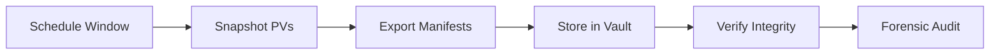

### 3. Application-Consistent Backup Topology
Strategically coordinating backups across databases, persistent volumes, and cluster-wide configuration manifests, providing a unified institutional view of workload state and dependencies.

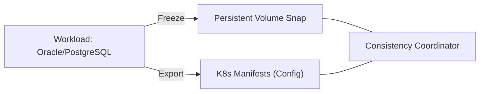

### 4. Cross-Region & Multi-Cloud Recovery Flow
Managing the sequential restoration of clusters across cloud providers or geographic regions for disaster recovery, ensuring zero-interruption service availability.

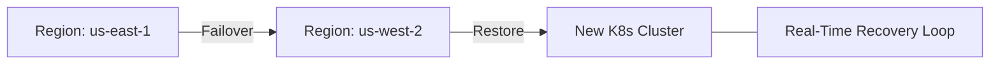

### 5. Distributed Backup Storage & Immutable Vault Flow
Protecting backups in air-gapped, object-lock (WORM) storage environments, ensuring that institutional data is protected against ransomware and accidental deletion.

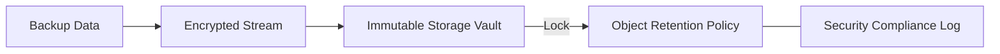

### 6. Automated Restore Validation & Sandbox Test Flow
Frequently testing restores in temporary, isolated sandbox clusters to verify data integrity and recovery runbooks, ensuring that backups are actionable when needed.

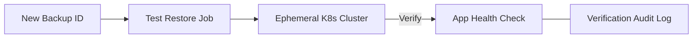

### 7. Institutional Backup Maturity Scorecard
Grading organizational performance based on key indicators: RPO/RTO Compliance, Backup Success Rate, and Automated Restore Verification Frequency.

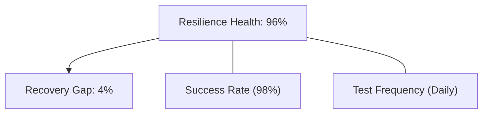

### 8. Identity & RBAC for Backup Governance
Managing fine-grained access to backup schedules, recovery triggers, and audit logs between Backup Admins, Cluster Operators, and Compliance Auditors.

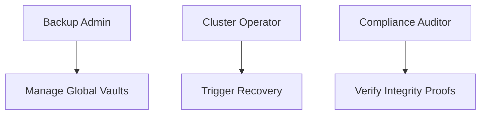

### 9. IaC Deployment: Backup-as-Code Framework
Using modular Terraform to deploy and manage the versioned distribution of the backup tracking hubs, synchronization workers, and forensic metadata lakes.

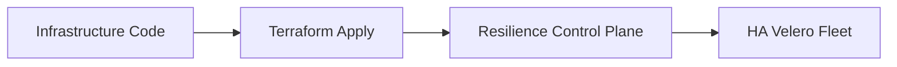

### 10. AIOps Backup Anomaly & Data Corruption Validation Flow
Using advanced analytics to identify "Silent Failures" or unusual shrinking of backup sizes that could result in institutional data corruption or incomplete recovery.

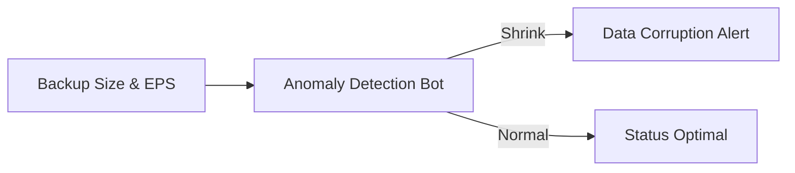

### 11. Metadata Lake for Forensic Backup Audit
Storing long-term records of every backup event, every restore triggered, and every verification passed for institutional record-keeping, compliance auditing, and post-recovery forensics.

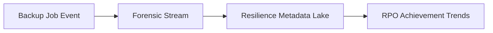

---

## 🏛️ Core Resilience Pillars

1.  **Unified Backup Coordination**: Maximizing resilience by centralizing all cluster protection through a single institutional plane.
2.  **Automated Integrity Validation**: Eliminating "broken backup" scenarios through proactive sandbox restore verification.
3.  **Sequential Recovery Intelligence**: Ensuring zero-interruption service through dependency-aware cluster restorations.
4.  **Zero-Trust Storage Protection**: Automatically enforcing object-locking and air-gapped isolation across all vaults.
5.  **Autonomous Recovery Logic**: Guaranteeing service restoration through automated cross-region recovery runbooks.
6.  **Full Resilience Auditability**: Immutable recording of every backup and verification event for institutional forensics.

---

## 🛠️ Technical Stack & Implementation

### Resilience Engine & APIs
*   **Framework**: Python 3.11+ / FastAPI.
*   **Backup Core**: Velero with CSI snapshot plugins and Restic for data-level protection.
*   **Storage Plane**: AWS S3, Azure Blob, or GCP GCS with Object-Locking enabled.
*   **Persistence**: PostgreSQL (Backup Ledger) and Redis (Live Job State).
*   **Auth Orchestrator**: Federated OIDC/SAML for least-privilege resilience access.

### Resilience Dashboard (UI)
*   **Framework**: React 18 / Vite.
*   **Theme**: Dark, Blue, Slate (Modern high-fidelity resilience aesthetic).
*   **Visualization**: D3.js for recovery topologies and Recharts for RPO/RTO analytics.

### Infrastructure & DevOps
*   **Runtime**: AWS EKS or Azure Kubernetes Service (AKS) for management plane.
*   **Vault Hub**: Cross-region replicated object storage with WORM policies.
*   **IaC**: Modular Terraform for deploying the resilience landing zone and backup fleet.

---

## 🏗️ IaC Mapping (Module Structure)

| Module | Purpose | Real Services |
| :--- | :--- | :--- |
| **`infrastructure/id_hub`** | Central management plane | EKS, PostgreSQL, Redis |
| **`infrastructure/backup_fleet`** | Velero & Restic workers | K8s Deployment, Helm |
| **`infrastructure/vaults`** | Immutable storage sinks | S3, Object Lock, IAM |
| **`infrastructure/auditing`** | Forensic resilience sinks | S3, Athena, Quicksight |

---

## 🚀 Deployment Guide

### Local Principal Environment
```bash
# Clone the backup platform
git clone https://github.com/devopstrio/kubernetes-backup-blueprint.git
cd kubernetes-backup-blueprint

# Configure environment
cp .env.example .env

# Launch the Resilience stack
make init

# Trigger a mock backup and sandbox restore simulation
make simulate-resilience
```

Access the Resilience Hub at `http://localhost:3000`.

---

## 📜 License
Distributed under the MIT License. See `LICENSE` for more information.

---
<div align="center">
  <p>© 2026 Devopstrio. All rights reserved.</p>
</div>
