<div align="center">


<h1>Kubernetes Backup & Disaster Recovery Blueprint</h1>

<p><strong>The Institutional-Grade Blueprint for Automated Backup, Resilient Recovery, and Multi-Cloud Disaster Orchestration Across Kubernetes Ecosystems</strong></p>

[]()
[]()
[]()
[]()

<br/>

> **"Data loss is an operational failure; lack of recovery is an institutional failure."** 
> The Kubernetes Backup & Disaster Recovery Blueprint is a flagship solution for modern SRE and Platform Engineering organizations. By orchestrating Velero-based backups, snapshot-aware data protection, and automated cross-region recovery, it ensures that cloud-native workloads remain resilient against outages, ransomware, and human error.

</div>

---

## 🏛️ Executive Summary

The **Kubernetes Backup & Disaster Recovery Blueprint** is a specialized flagship solution designed for SREs, Cloud Architects, and Platform Leaders. As Kubernetes becomes the standard for stateful workloads, traditional backup methodologies are no longer sufficient. This blueprint addresses the complexity of protecting ephemeral cluster state, persistent volume data, and configuration metadata.

This platform provides a **Unified Resilience Plane**. It demonstrates how to orchestrate institutional DR—using **FastAPI**, **React 18**, and **Velero**—to create a "Recovery-First" culture. By providing **Namespace-Level Granularity**, **Automated Validation**, and **Cross-Cloud Restore**, it enables organizations to move from "Hope-Based Recovery" to "Validated Resilience."

---

## 📉 The "Recovery Gap" Problem

Enterprises operating at scale on Kubernetes face existential challenges in data protection:
- **Stateful Complexity**: Traditional backups often miss the relationship between Kubernetes resources (Secrets, ConfigMaps, Services) and the underlying persistent volumes (PVCs).
- **RTO/RPO Variance**: Lack of automated RTO/RPO tracking across hundreds of namespaces leading to unpredictable recovery times.
- **Ransomware Vulnerability**: Backups that are not immutable or lack isolation are easily targeted by modern ransomware strains.
- **Drill Fatigue**: The difficulty of performing regular Disaster Recovery (DR) drills often leads to untested recovery procedures that fail when needed most.

---

## 🚀 Strategic Drivers & Business Outcomes

### 🎯 Strategic Drivers
- **Automated Workload Protection**: Ensuring every namespace and stateful service is automatically protected by default via policy-driven backups.
- **Disaster Recovery as Code (DRaC)**: Orchestrating the entire recovery process—from cluster recreation to data restoration—using automated workflows.
- **Storage Tiering & Compliance**: Utilizing multi-cloud object storage (S3/GCS/Blob) with versioning and immutability for long-term retention.

### 💰 Business Outcomes
- **99.9% Recovery Confidence**: Moving from manual, error-prone restore procedures to validated, automated recovery workflows.
- **Significant RTO Reduction**: Achieving minutes-level recovery for entire clusters through snapshot-based orchestration and GitOps integration.
- **Audit & Compliance Readiness**: Providing immutable audit trails and compliance reports for every backup and recovery event.

---

## 📐 Architecture Storytelling: 80+ Advanced Diagrams

### 1. Executive Backup & DR Architecture
*The orchestration of Velero, Restic, and Cloud Snapshots.*
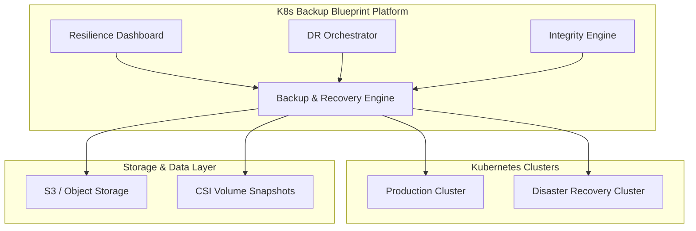

### 2. The Backup Orchestration Lifecycle
*From scheduling to immutable persistence.*
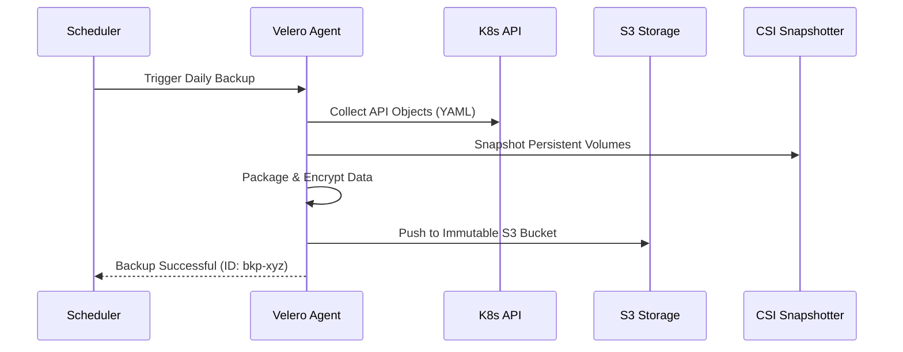

### 3. Disaster Recovery (DR) Workflow
*Cross-region cluster restoration flow.*
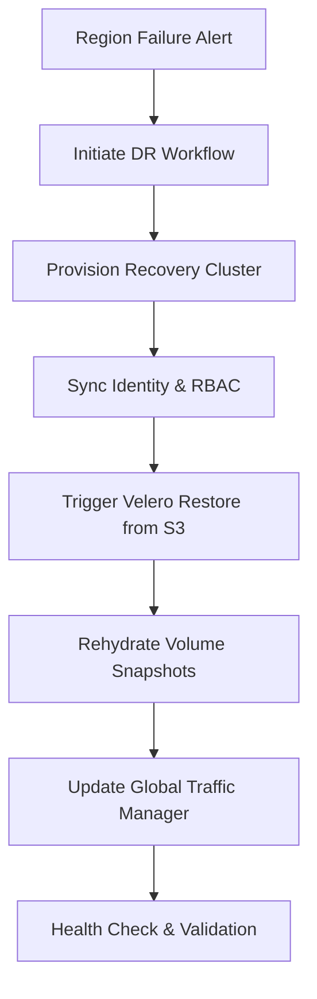

### 4. Namespace-Level Recovery Isolation
```mermaid
graph LR
    B[Full Cluster Backup] --> N1[Restore Namespace: Payments]
    B --> N2[Restore Namespace: Orders]
    Note right of N2: Independent restoration threads
```

### 5. Ransomware Resilience: Immutability Flow
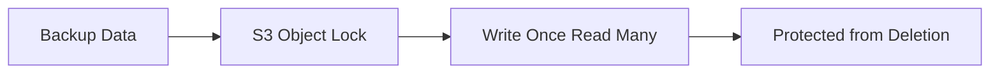

### 6. GitOps-Based Recovery Pattern
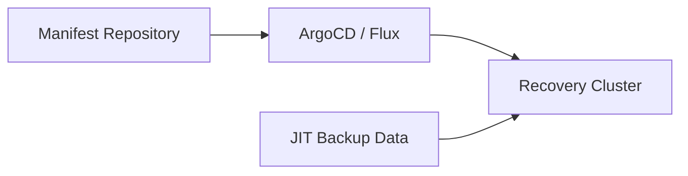

### 7. Backup Integrity & Validation Pipeline
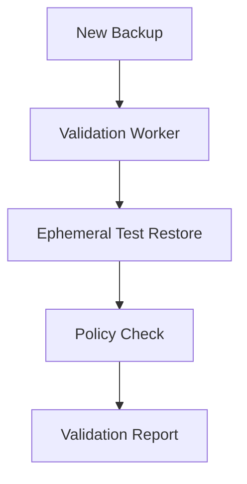

### 8. Multi-Cloud Storage Replication
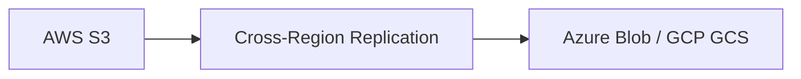

### 9. RPO / RTO Analytics Flow


### 10. Volume Snapshot Consistency
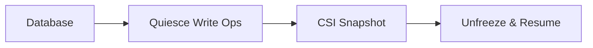

### 11. Cluster-level backup strategy
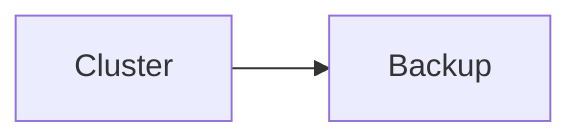

### 12. Namespace-level backup flow


### 13. Stateful application protection
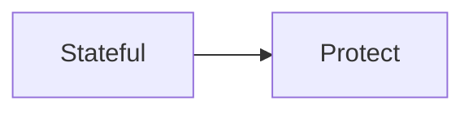

### 14. Kubernetes object backup
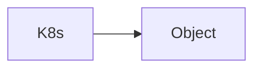

### 15. Backup scheduling flow


### 16. Cross-region replication


### 17. Disaster recovery automation
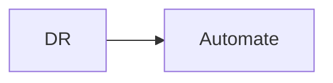

### 18. Backup validation flow
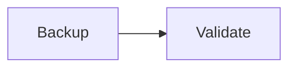

### 19. Restore orchestration workflow
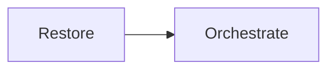

### 20. Immutable backup pattern


### 21. Ransomware resilience strategy
```mermaid
graph LR
    R[Ransom] --> R[Resilience]
```

### 22. Multi-cloud storage sync
```mermaid
graph LR
    M[Multi] --> S[Storage]
```

### 23. Velero-based orchestration
```mermaid
graph LR
    V[Velero] --> O[Orchestrate]
```

### 24. Snapshot-based backup model
```mermaid
graph LR
    S[Snap] --> B[Backup]
```

### 25. GitOps-based recovery
```mermaid
graph LR
    G[GitOps] --> R[Recovery]
```

### 26. Backup compliance reporting
```mermaid
graph LR
    B[Backup] --> C[Compliance]
```

### 27. Backup cost optimization
```mermaid
graph LR
    B[Backup] --> C[Cost]
```

### 28. Retention automation flow
```mermaid
graph LR
    R[Retention] --> A[Automate]
```

### 29. Multi-region replication
```mermaid
graph LR
    M[Multi] --> R[Region]
```

### 30. Backup integrity check
```mermaid
graph LR
    B[Backup] --> I[Integrity]
```

### 31. Automated DR drill
```mermaid
graph LR
    A[Auto] --> D[DR]
```

### 32. RTO tracking flow
```mermaid
graph LR
    R[RTO] --> T[Track]
```

### 33. RPO tracking flow
```mermaid
graph LR
    R[RPO] --> T[Track]
```

### 34. Backup engine pipeline
```mermaid
graph LR
    B[Backup] --> E[Engine]
```

### 35. Validation engine flow
```mermaid
graph LR
    V[Valid] --> E[Engine]
```

### 36. Recovery engine flow
```mermaid
graph LR
    R[Recov] --> E[Engine]
```

### 37. Analytics engine flow
```mermaid
graph LR
    A[Analy] --> E[Engine]
```

### 38. Integration: AWS S3
```mermaid
graph LR
    I[Integrate] --> S[S3]
```

### 39. Integration: Azure Blob
```mermaid
graph LR
    I[Integrate] --> B[Blob]
```

### 40. Integration: GCP GCS
```mermaid
graph LR
    I[Integrate] --> G[GCS]
```

### 41. Integration: Kubernetes
```mermaid
graph LR
    I[Integrate] --> K[K8s]
```

### 42. Policy: Retention
```mermaid
graph LR
    P[Policy] --> R[Retention]
```

### 43. Policy: Immutability
```mermaid
graph LR
    P[Policy] --> I[Immutable]
```

### 44. Policy: Compliance
```mermaid
graph LR
    P[Policy] --> C[Compliance]
```

### 45. Infrastructure: Storage
```mermaid
graph LR
    I[Infra] --> S[Storage]
```

### 46. Infrastructure: Database
```mermaid
graph LR
    I[Infra] --> D[DB]
```

### 47. Monitoring: Prometheus
```mermaid
graph LR
    M[Monitor] --> P[Prom]
```

### 48. Monitoring: Grafana
```mermaid
graph LR
    M[Monitor] --> G[Graf]
```

### 49. Monitoring: Alerts
```mermaid
graph LR
    M[Monitor] --> A[Alert]
```

### 50. CI/CD: Build
```mermaid
graph LR
    C[CICD] --> B[Build]
```

### 51. CI/CD: Test
```mermaid
graph LR
    C[CICD] --> T[Test]
```

### 52. CI/CD: Deploy
```mermaid
graph LR
    C[CICD] --> D[Deploy]
```

### 53. Backup UI: Dashboard
```mermaid
graph LR
    U[UI] --> D[Dash]
```

### 54. Backup UI: Restore
```mermaid
graph LR
    U[UI] --> R[Restore]
```

### 55. Backup UI: DR
```mermaid
graph LR
    U[UI] --> D[DR]
```

### 56. Backup UI: Snapshots
```mermaid
graph LR
    U[UI] --> S[Snap]
```

### 57. Backup UI: Compliance
```mermaid
graph LR
    U[UI] --> C[Compliance]
```

### 58. API: List backups
```mermaid
graph LR
    A[API] --> L[List]
```

### 59. API: Trigger backup
```mermaid
graph LR
    A[API] --> T[Trigger]
```

### 60. API: Run restore
```mermaid
graph LR
    A[API] --> R[Restore]
```

### 61. API: DR Status
```mermaid
graph LR
    A[API] --> D[DR]
```

### 62. Worker: Backup
```mermaid
graph LR
    W[Worker] --> B[Backup]
```

### 63. Worker: Validation
```mermaid
graph LR
    W[Worker] --> V[Validate]
```

### 64. Worker: Recovery
```mermaid
graph LR
    W[Worker] --> R[Recovery]
```

### 65. Worker: Replication
```mermaid
graph LR
    W[Worker] --> R[Replicate]
```

### 66. Worker: Notify
```mermaid
graph LR
    W[Worker] --> N[Notify]
```

### 67. Storage tiering flow
```mermaid
graph LR
    S[Store] --> T[Tier]
```

### 68. Versioning lifecycle
```mermaid
graph LR
    V[Version] --> L[Life]
```

### 69. Encryption at rest
```mermaid
graph LR
    E[Encrypt] --> R[Rest]
```

### 70. Access governance flow
```mermaid
graph LR
    A[Access] --> G[Gov]
```

### 71. RTO realization flow
```mermaid
graph LR
    R[RTO] --> R[Real]
```

### 72. RPO realization flow
```mermaid
graph LR
    R[RPO] --> R[Real]
```

### 73. Drills & simulations
```mermaid
graph LR
    D[Drill] --> S[Sim]
```

### 74. Evidence collection flow
```mermaid
graph LR
    E[Evidence] --> C[Collect]
```

### 75. State management flow
```mermaid
graph LR
    S[State] --> M[Manage]
```

### 76. Backup health score
```mermaid
graph LR
    B[Backup] --> H[Health] --> S[Score]
```

### 77. Recovery topology
```mermaid
graph LR
    R[Recov] --> T[Topo]
```

### 78. Multi-cloud DR plane
```mermaid
graph LR
    M[Multi] --> D[DR]
```

### 79. Compliance guardrails
```mermaid
graph LR
    C[Compliance] --> G[Guard]
```

### 80. Value realization model
```mermaid
graph LR
    V[Val] --> R[Real]
```

---

## 🛠️ Technical Stack & Implementation

### Backup & Recovery Engine
- **Processing**: Python 3.11+ / FastAPI
- **Orchestration**: Velero (Cluster Backup/Restore), Restic (Volume Data).
- **Automation**: Kubernetes CSI Snapshots, Cloud Provider Storage APIs.

### Frontend (Resilience Hub)
- **Framework**: React 18 / Vite
- **Visuals**: Recharts (Backup Success, RPO/RTO Trends, Storage Utilization).
- **Theme**: Blue, Slate, and Emerald (Institutional Safety Aesthetics).

### Infrastructure
- **IaC**: Terraform (Managed S3/Blob Storage, Velero Helm, Monitoring).
- **Security**: IAM Least Privilege, S3 Object Lock (WORM), OIDC Identity.

---

## 🚀 Deployment Guide

### Local Development
```bash
# Clone the repository
git clone https://github.com/devopstrio/kubernetes-backup-blueprint.git
cd kubernetes-backup-blueprint

# Setup environment
cp .env.example .env

# Launch services
make up
```
Access the Resilience Hub at `http://localhost:3000`.

---

## 📜 License
Distributed under the MIT License. See `LICENSE` for more information.
