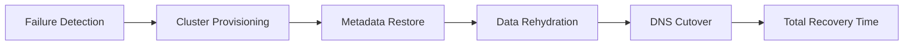
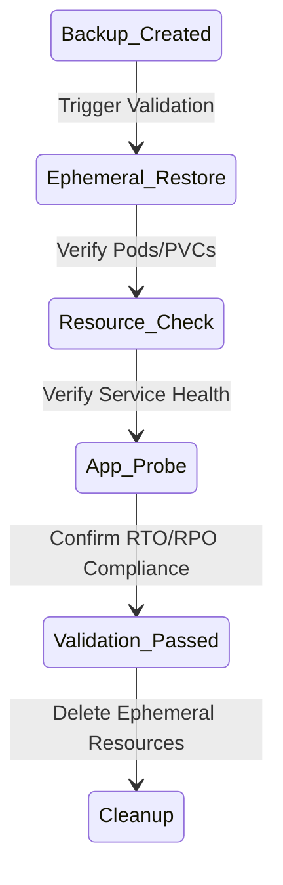

# Architecture & Resilience Diagrams

## 11. Cross-Region Recovery Topology (Detailed)
*How the platform orchestrates recovery in a secondary cloud region.*

```mermaid
graph TD
    subgraph "Primary Region (Region A)"
        PCluster[Primary Cluster]
        PStorage[S3: Primary Backups]
    end
    subgraph "Recovery Region (Region B)"
        RCluster[Recovery Cluster]
        RStorage[S3: Replicated Backups]
    end
    subgraph "Control Plane"
        Portal[Resilience Hub]
        Engine[Recovery Engine]
    end
    PStorage -->|Cross-Region Replication| RStorage
    Portal --> Engine
    Engine --> RCluster: Trigger Restore
    RStorage --> RCluster: Rehydrate Data
```

## 13. "Recovery Time Objective" (RTO) Breakdown


## 20. Backup Validation Strategy

