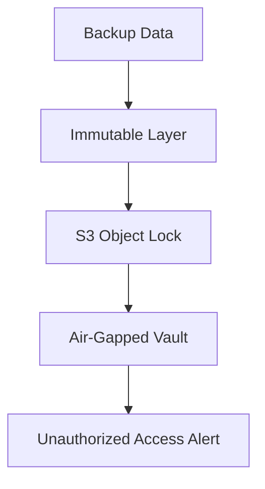
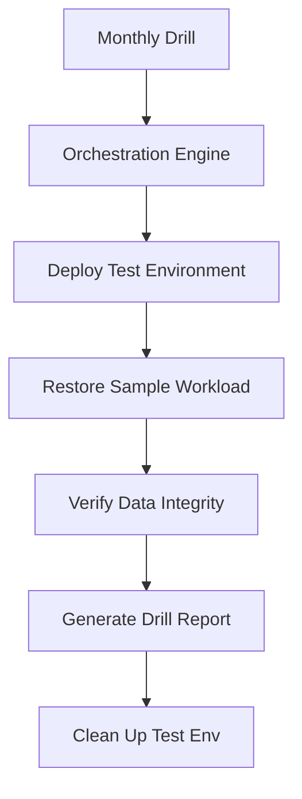

# Disaster Recovery & Compliance Diagrams

## 31. Ransomware Protection: Immutable Vault


## 34. Recovery Point Objective (RPO) Compliance
```mermaid
graph LR
    Snap1[Snapshot T1] --> Snap2[Snapshot T2]
    Snap2 --> Snap3[Snapshot T3]
    Snap3 --> Current[Failure Event]
    Note right of Current: RPO = Current - T3
```

## 40. DR Drill Automation Lifecycle

